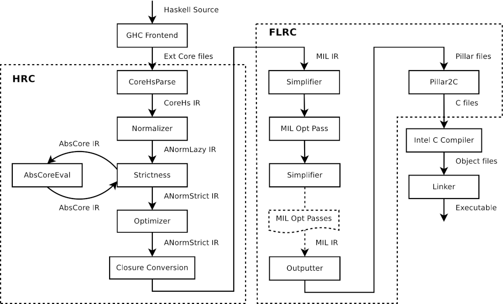

# The Functional Language Research Compiler

The Functional Language Research Compiler (FLRC) was designed to be a general
compiler framework for functional languages. The only supported compiler that
is being released is a Haskell Research Compiler (HRC). The overall compilation
pipeline is pictured in the following diagram:



## Installation

FLRC requires [FLRC-LIB] to be installed prior to its installation.
Other software required are autoconf/automake, pkgconfig, [the MLton
compiler][mlton], and a C/C++ compiler. 

All released code has only been tested to work on x86 64-bit Linux distros,
although they were originally written for x86 32-bit Windows.

To install:

```
sh bootstrap.sh
./configure --prefix=${PREFIX}
make && make install
```

In the process, it will also download a version of MLton compiler's source to
extract some SML libraries, and the process should be automatic. Once the
installation is finished, a binary command `hrc` and some runtime headers and
libraries can be found under the given `${PREFIX}` path.

## Usage

To actually compile a Haskell program, we'll also need a patched version of
GHC. See [Building and Using GHC with HRC](doc/building-ghc.md) for more
information.

To get a list of compiler options, call the compiler with any invalid
option (e.g. `-help`).

Examples:

To list the flrc options:

```
hrc -help
```

To list the flrc expert options:

```
hrc -expert -help
```

One can also pass runtime options to the executable compiled by HRC.  Options
are passed in the form:

```
./[executable] @PPiler [opts]* -- [normal arguments]
```

These options must come before any program options, and only one `@PPiler`
section is supported. A list of options can be obtained by passing any invalid
option (e.g. -help).  Currently, there are options for the number of threads to
run in the futures back end, and to set the initial and max heap size for the
conservative GC.

## Questions

FLRC is open sourced as is. We at Intel Labs are no longer actively working on
this compiler. Please use the issue track if you have questions.

## Related Publication

Neal Glew, Tim Sweeney, and Leaf Petersen. 2013. [A multivalued language with a dependent type system](http://dl.acm.org/citation.cfm?doid=2502409.2502412). In Proceedings of the 2013 ACM SIGPLAN workshop on Dependently-typed programming (DTP '13). ACM, New York, NY, USA, 25-36.

Hai Liu, Neal Glew, Leaf Petersen, and Todd A. Anderson. 2013. [The Intel labs Haskell research compiler](https://dl.acm.org/citation.cfm?id=2503779). In Proceedings of the 2013 ACM SIGPLAN symposium on Haskell (Haskell '13). ACM, New York, NY, USA, 105-116.

Leaf Petersen, Todd A. Anderson, Hai Liu, and Neal Glew. 2013. [Measuring the Haskell Gap](http://dl.acm.org/citation.cfm?doid=2620678.2620685). In Proceedings of the 25th symposium on Implementation and Application of Functional Languages (IFL '13). ACM, New York, NY, USA, , Pages 61 , 12 pages. 

Leaf Petersen, Dominic Orchard, and Neal Glew. 2013. [Automatic SIMD vectorization for Haskell](http://dl.acm.org/citation.cfm?doid=2500365.2500605). In Proceedings of the 18th ACM SIGPLAN international conference on Functional programming (ICFP '13). ACM, New York, NY, USA, 25-36.

Neal Glew and Leaf Petersen. 2012. [Type-Preserving Flow Analysis and Interprocedural Unboxing (Extended Version)](https://arxiv.org/abs/1203.1986). Tech Report.

Leaf Petersen and Neal Glew. 2012. [GC-Safe interprocedural unboxing](http://dl.acm.org/citation.cfm?id=2259242). In Proceedings of the 21st international conference on Compiler Construction (CC'12), Michael O'Boyle (Ed.). Springer-Verlag, Berlin, Heidelberg, 165-184. 

## License

This software carries a BSD style license. See [LICENSE_INFO](LICENSE_INFO.txt) for more information.
 

[flrc-lib]: https://github.com/IntelLabs/flrc-lib
[mlton]: http://mlton.org

